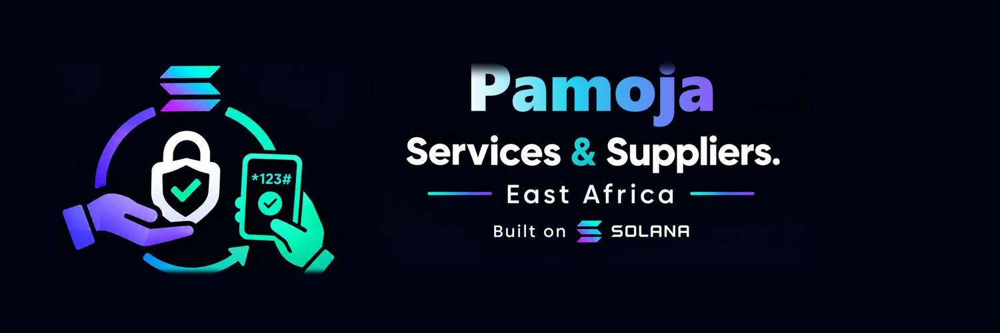

<p align="center"></p>

# Omukwano_Serve

Pay when the service is done. Customers lock a deposit, the provider does the job, and the money releases when the customer confirms with a short code — built on Solana for local businesses (salons, repairs, rides, food, shops and suppliers) in Uganda.

> Status: early prototype for Encode Club Solana Hackathon 2026. The code is currently a counter starter that is being turned into the escrow program.

## Docs

- [How it works](docs/how-it-works.md)
- [Escrow build spec](docs/escrow-design.md)
- [Deployment](docs/deployment.md)

## Layout

- `counter-program/` — Anchor program (Rust). Build/deploy from WSL (solana + anchor live there).
- `frontend/` — Vite + React + wallet-adapter.

## Run

```bash
# Program (WSL)
cd counter-program && anchor build

# Frontend
cd frontend && npm install && npm run dev
```

## Roadmap

1. Escrow program: `Job` account and `create_job` are done; `fund_job`, `release`, `cancel` and `refund` are next. See [`docs/escrow-design.md`](docs/escrow-design.md).
2. Frontend job flow for customer and provider.
3. Mobile money and bank transfer on-ramp via a payment partner.
